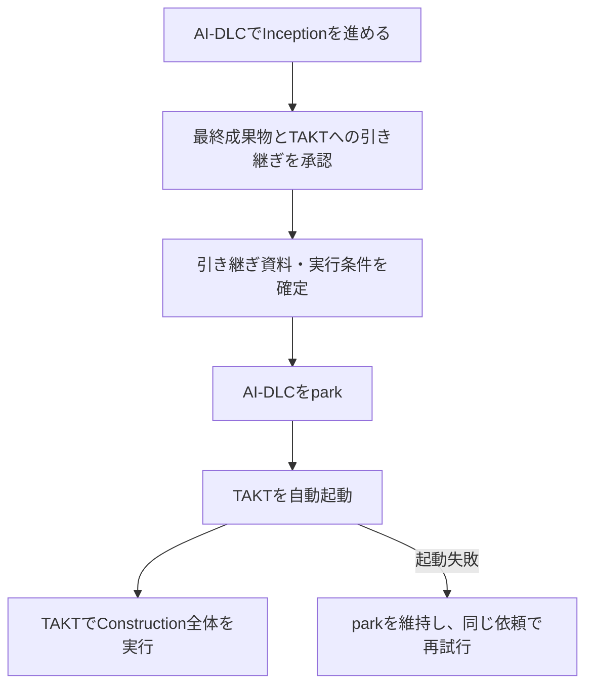

# Inceptionの承認後にTAKTを自動起動する

> 進捗: Claude Codeプラグインによる最終承認後の自動引き継ぎと、設計・レビュー・修正を含むConstruction用Workflowを実装した。[実セッションの記録](../experiments/native-session/STATUS.md)と[Constructionの検証結果](../experiments/construction/RESULTS.md)を参照。

## ユーザーの操作はInceptionの最終承認まで

AI-DLCがInceptionを進め、ユーザーが最終成果物とTAKTへの引き継ぎを承認したら、連携処理がAI-DLCをparkし、TAKTでConstruction全体を開始する。ユーザーが成果物をコピーしたり、別の端末で起動コマンドを入力したりする手間を省く。

これは会話を踏まえた設計案であり、上流の既存設定項目ではない。現在はこのリポジトリに接続部分のPoCを追加している。これまで比較していた「AI-DLCの工程内でTAKTへUnitの実装を委譲する案」に加え、自動起動を伴う工程間の引き継ぎを第一候補とする。

自動起動後の詳細設計、実装、レビュー、修正、全体検証はTAKTのWorkflowが管理する。必要な設計判断では人へ確認する。Inceptionの承認を、後で作る詳細設計やすべての変更に対する包括承認として扱わない。

## AI-DLC側に必要なのは引き継ぎを開始する接続点

既存のAI-DLCにはparkと、工程の結果をエンジンへ報告する仕組みがある。TAKTにも直接実行CLIがある。この間に、成果物の受け渡しと起動を担当する連携処理を置く。[AI-DLCの工程制御](https://github.com/awslabs/aidlc-workflows/blob/v2.8.2/docs/reference/17-skill-system.md)、[TAKTのCLI](https://github.com/nrslib/takt/blob/v0.65.0/docs/cli-reference.md)

接続点は、Inception最後の対象工程の承認がエンジンへ反映され、Constructionの作業を始める前に置く。最初の対象スコープを、Delivery PlanningがInceptionの最後になるものに限定すると試作しやすい。以後、工程が省略されるスコープにも対応する。

プラグインは工程の本文への処理追加に対応するが、本文末尾は「最終承認が反映された直後」と同じではない。確認した拡張仕様には専用の承認後コールバックを見つけられていない。この実装ではClaude CodeのPreToolUseとPostToolUseを接続点とし、AI-DLC本体へのパッチを避けている。[プラグインの拡張仕様](https://github.com/awslabs/aidlc-workflows/blob/v2.8.2/docs/harness-engineering/10-authoring-a-plugin.md)

この構成では、AI-DLCのCode Generation担当を置き換える必要はない。AI-DLCがConstructionの作業を開始する前に管理を引き継ぐためである。ただし、引き継ぎ後に通常の工程継続が走らないことを検証する必要はある。

## 引き継ぎは再試行できる一つの依頼として扱う

連携処理は次の順序で動く設計とする。

1. 承認済みInception成果物、Unitと依存関係、開発方針、ソースの基準、選択したTAKT Workflowを確定する。
2. Intentと成果物の版に結び付いた依頼IDを保存し、必要なコマンド・Workflowが利用できるか確認する。
3. エンジン経由でAI-DLCをparkし、停止状態を確認する。
4. 確定した依頼をTAKTへ渡して起動し、Runとの対応を保存する。

起動に失敗した場合はAI-DLCをparkしたまま理由を知らせる。再試行では既存のプロセスやRunを確認し、同じ依頼を重複起動しない。処理が「起動成功、対応保存前」で中断した場合にも照合できる記録方法をPoCで検証する。

最初はCLIによる直接実行を候補とする。MCPを使う場合はタスク登録に加えて実行プロセスの用意が必要になる。tmuxはこの引き継ぎの必須要素ではない。[TAKTのMCP連携](https://github.com/nrslib/takt/blob/v0.65.0/docs/cli-reference.md#mcp-server)

## Construction全体に対応する専用Workflowを用意する

TAKTには、入力確認、必要な詳細設計、設計確認、Unitごとの実装・レビュー・修正、全体検証を含むWorkflowを用意する。要求や共有契約の変更が必要なら、Construction内だけで変更を確定せず、Inceptionの見直しへ戻す。

TAKT完了後もAI-DLCはpark中である。初期版はTAKTの完了報告までを範囲とし、AI-DLCのOperationへ復帰する場合は、成果物の受け入れと工程状態の反映を別途設計する。

## parkはフックの停止ではないため、入力と実行環境を分ける

v2.8.2のparkは停止位置を記録する処理で、フックを解除する処理ではない。通常はStopフックが停止を認めるが、Constructionの自律実行モードではpark自体が拒否される。自動引き継ぎは、AI-DLC側でその自律実行に入る前に行う。[parkの実装](https://github.com/awslabs/aidlc-workflows/blob/v2.8.2/core/tools/aidlc-state.ts)

書き込みの可否は個々のフックが判定する。Review Freezeは未完了工程の終端レビュー記録などを保護するもので、完了済みInceptionの全ファイルを一律にロックする仕組みではない。一方、現在の工程や指示がCode Generationなら、Plan Approval Guardはアプリケーションのソース変更も承認条件に照らして拒否しうる。どちらにもparkを理由に判定を一律停止する分岐はない。[Review Freeze](https://github.com/awslabs/aidlc-workflows/blob/v2.8.2/core/hooks/aidlc-review-freeze.ts)、[Plan Approval Guard](https://github.com/awslabs/aidlc-workflows/blob/v2.8.2/core/hooks/aidlc-plan-approval-guard.ts)

したがって、TAKTがAI-DLC文書を読むだけにする方針は採用するが、それだけでフックとの干渉が解消するとは扱わない。引き継ぎ時点の成果物を固定したコピーにし、次の境界で設計する。

| 対象 | TAKT側の扱い |
|---|---|
| 元のAI-DLCの要求・設計・Unit分割 | 更新しない。引き継ぎ時の内容を参照する |
| 元のAI-DLCの状態・監査・承認記録 | 更新しない。AI-DLC側の管理に残す |
| 引き継ぎ用コピー | 元ファイルのパスと内容のハッシュを添え、読取専用の入力にする |
| Constructionの詳細設計・実装計画・テスト結果 | AI-DLCの記録領域とは別のTAKT側の出力先に作る |
| アプリケーションのソース・テスト | TAKTの作業領域で更新する |

元の要求・契約に変更が必要になったら、TAKTは変更依頼を出し、AI-DLC側で再検討する。再承認した成果物は新しい版として引き継ぎ、実行中の入力を無断で差し替えない。

実行環境も分ける。TAKTが起動するハーネスには、必要なプロジェクト規約や通常の権限制御を維持しつつ、parkしたAI-DLCの工程を制御するフック・状態を引き継がない構成を用意する。元環境のガードを解除して同じ記録へ書く方式にはしない。別worktreeでも、追跡対象の設定ファイルがコピーされるため、worktreeの分離だけで達成したと判断しない。別環境への起動コマンド自体も元セッションのフックによる判定対象になりうるため、承認後の接続点では起動まで含めて検証する。

また、AI-DLCのフック自身が監査や動作確認用ファイルを書く場合もある。TAKTへの「文書を編集しない」という指示だけでは、フックによる更新を防げない。[書き込み監査フック](https://github.com/awslabs/aidlc-workflows/blob/v2.8.2/core/hooks/aidlc-write-audit-log.ts)

PoCでは、TAKTの実装・テスト実行時にAI-DLC由来の拒否が起きないこと、入力コピーが変わらないこと、TAKTの実行によって元のAI-DLCの状態・承認記録が更新されないことを確認する。コピーの読取専用化を指示だけで済ませず、実行環境の書き込み制約と実行前後のハッシュ照合で検証する。この節はソースの静的確認に基づく設計であり、実機で確認できた範囲は冒頭の実験報告に記載している。

## 実装済みの範囲と次の拡張

接続部分は[プラグインの説明](claude-plugin.md)、Construction内の工程と停止条件は[専用Workflowの説明](construction-workflow.md)にまとめた。次の拡張候補は、複数Unitの独立実行、対応ハーネスの追加、TAKTの結果を受け入れてAI-DLCのOperationへ戻す手順である。
