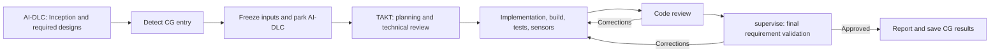

# Run the Code Generation stage with TAKT

[日本語](code-generation-stage.ja.md)

## Integration structure

AI-DLC handles Inception and the required Construction designs normally. When `next` or `continue` returns `run-stage / code-generation`, the selected Claude Code or Codex host's PostToolUse hook freezes inputs and parks AI-DLC through the official CLI. TAKT runs CG in a separate workspace.

This is a Claude Code / Codex host plugin. It requires neither an AI-DLC custom stage nor a core patch, and does not use tmux. TAKT workers may use Claude or Codex.

## Mapping native CG responsibilities

| Native CG responsibility | TAKT implementation |
|---|---|
| Read inputs and plan | `plan`: derive implementation steps from the Intent, current unit designs, CG definition, conventions, and knowledge |
| Check the plan | `plan-review`: automatic technical review; return to `plan` for corrections |
| Generate code and record artifacts | `implement`: create source, tests, the change manifest, and requirement mappings |
| Validate the implementation | Run fixed build, test, and sensor scripts |
| Review and correct code | `code-review` → `fix` → repeat checks and review |
| Final requirement validation | `supervise`: use built-in supervisor/supervise to independently compare current code with the Intent, all requirement IDs, and earlier findings; return to fix when needed |
| Report completion | `finish`: summarize measured results, then rebuild and retest once more |

Automatic technical decisions replace human plan approval and approval after the walking skeleton. TAKT does not wait for questions. Contradictory or insufficient inputs that cannot be resolved autonomously produce `blocked`. Execution has a 20-step maximum and a time limit.

CG-only mode does not delegate the entire native Build and Test stage. It does run the checks needed for CG to return buildable, testable code.

## Original sources passed to TAKT

The integration expands source contents into the instructions for each role:

- `.claude/aidlc-common/stages/construction/code-generation.md`
- The current Intent's `project-description.json` and configured Inception artifacts
- Functional, NFR, and infrastructure design Markdown for the current unit
- Organization, team, and project memory; Construction conventions; shared knowledge
- Developer, architecture-reviewer, and quality agent definitions and knowledge
- Sensor Markdown named by CG and any available artifact templates
- Fixed build, test, and type-check scripts

The original Testing Contract text and hash come from `aidlc engine testing-posture render`. Required IDs are resolved with a read-only probe of the native traceability tool. The probe is neither an official artifact nor an approval and is deleted afterward.

Read-only copies are placed in `input/project/`, the index in `input/context.json`, and per-step provenance/hashes in `control/injection.json`. The plan records specific rules and applications in `appliedRules` for review. Injecting a source does not prove that a model interpreted it correctly.

## Sensors and success conditions

| Check | Implementation |
|---|---|
| required-sections | Check H2 headings in the CG plan, unit-test instructions, and summary; honor custom template headings |
| traceability | Check all native requirement IDs, target files, actual changes, and agreement with the plan |
| linter / type-check | Run configured fixed scripts; require both exit code zero and JSON `pass: true` |
| build / test | Require exit code zero; enforce coverage and similar targets in the test script |

Sensor Markdown is part of the execution contract. Results are recorded in TAKT's ledger and `cg/sensors.json`. The native sensor dispatcher and audit events are not reproduced.

Each linter/type-check sensor requires either a script or an explicit exemption with a reason and a frozen source. Exemptions are recorded as `not_applicable`, not as passed checks. Unlike advisory or continue-on-failure behavior in native guidance, a required failed check prevents completion here.

Hashes bind the plan, test instructions, code, checks, reviews, and supervise approval. Completion requires approval after the latest code review for the same code. Changed inputs, post-review source changes, unplanned changes, missing checks, and failed builds/tests cannot be accepted as successful generation.

The supervisor does not review build/test logs. It independently judges requirements from code, while the runner separately enforces machine gates. All requirement IDs and code evidence are saved in `cg/supervision.json`.

## Outputs and state

Runs are stored under `aidlc/takt-handoff/code-generation-stage-runs/<id>/`.

- `status.json`: `parked` → `running` → `verified` / `blocked` / `failed`
- `snapshot/`: frozen inputs
- `attempts/1/work/`: generated source, tests, `cg/` artifacts, and TAKT reports
- `attempts/1/control/`: injection records, checking scripts, and ledger
- `attempts/1/final-build.json` and `final-test.json`: post-review verification

`verified` means this TAKT CG run passed validation. The original AI-DLC session remains parked at CG. Code import, native CG completion, and automatic resumption are not implemented. No human approval receipts or native audit rows are created.

## Current limits

- AI-DLC 2.8.2, State Version 8, one audit shard, and normal CG entry are required.
- Only `test-after` is supported. Other Testing Contracts, including TDD, are rejected before parking rather than silently reordered.
- One current unit is supported. Enumerate regular source files; globs and symlinks are unsupported.
- Do not combine this with native autonomous CG. Single-stage runners and arbitrary shell wrappers are unsupported entry points.
- Put build output under excluded directories such as `cg/` and coverage under `coverage/`. Arbitrary application output directories are not supported.
- This is not complete OS isolation from code running as the same user. Input hashes and provider permission controls are used together.
- Automatic stale-lock recovery, mid-run resumption, and CG retry through the CLI are not implemented.
