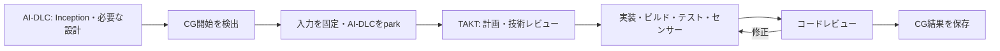

# Code GenerationをTAKTで実行する

## 接続の構造

AI-DLCは通常どおりInceptionと必要なConstruction設計を進める。`next`または`continue`が`run-stage / code-generation`を返した時点で、選択したホスト（Claude Code／Codex）のPostToolUseフックが入力を固定し、公式CLIでparkする。TAKTは別の作業領域でCGだけを実行する。

これはClaude Code／Codexのホストプラグインであり、AI-DLC独自Stageのプラグインや本体パッチではない。tmuxも不要。TAKTのワーカーはClaudeまたはCodexを使用する。

## 本家CGとの対応

| 本家CGの役割 | TAKTでの処理 |
|---|---|
| 入力読込・計画作成 | `plan`: Intent、現在のUnit設計、CG定義、規約と知識を使って実装手順を作る |
| 計画確認 | `plan-review`: 自動の技術レビュー。修正なら`plan`へ戻る |
| コード生成・成果物記録 | `implement`: ソース、テスト、変更一覧、要求との対応を生成する |
| 実装の検査 | 固定スクリプトでビルド、テスト、センサーを実行する |
| レビューと修正 | `code-review` → `fix` → 再検査・再レビュー |
| 完了報告 | `finish`: 実測結果をまとめ、最後にビルドとテストをもう一度確認する |

人間の計画承認とウォーキングスケルトン後の承認は、自動の技術判定へ置き換える。TAKT内には質問待ちを置かない。判断できない入力矛盾や要件不足は`blocked`で終了する。最大20ステップと実行時間の上限がある。

本家のBuild and Testステージ全体は委譲しない。ただし、CGがビルド・テストできるコードを返すために必要な検証はCG内で実行する。

## 原文をどう渡すか

パスだけを案内する方式ではなく、担当ステップごとに原文の本文をインストラクションへ展開する。

- `.claude/aidlc-common/stages/construction/code-generation.md`
- 現在のIntentの`project-description.json`と設定したInception成果物
- 現在のUnitのfunctional-design、NFR、infrastructure-designのMarkdown
- org・team・projectのmemory、Construction規約、共有知識
- developer、architecture-reviewer、qualityの担当者定義と関連知識
- CG定義が指定するセンサーのMarkdown、存在する成果物テンプレート
- ビルド・テスト・型検査などの固定スクリプト

`aidlc engine testing-posture render`で解決したTesting Contractも原文とhashを渡す。必要な要求IDは本家traceabilityツールの読み取り専用プローブで解決する。プローブは正規の成果物でも承認でもなく、終了後に削除する。

`input/project/`に読み取り用コピー、`input/context.json`に索引、`control/injection.json`に各ステップへ渡した出典とhashを残す。計画の`appliedRules`には、適用した規則と使い方を記録させ、技術レビューで照合する。注入した事実と、モデルが意味を正しく理解したことは区別する。

## センサーと成功条件

| 検査 | 実装 |
|---|---|
| required-sections | CG計画、Unitテスト手順、完了報告のH2見出しを確認。独自テンプレートがある場合はその見出しを要求 |
| traceability | 本家が解決した全要求ID、CGの対象ファイル、実際の変更一覧、計画との一致を確認 |
| linter / type-check | プロジェクトが指定した固定スクリプトを実行。終了コード0とJSONの`pass: true`の両方を要求 |
| build / test | 固定スクリプトの終了コード0を必須とする。カバレッジなどの目標はテストスクリプトに実装 |

センサーのMarkdownは実行契約として渡す。検査結果はTAKT側のledgerと`cg/sensors.json`へ記録する。ネイティブのセンサーディスパッチャーと監査イベントは再現しない。

linterとtype-checkには、検査スクリプト、または理由と固定入力の出典を持つ明示的な適用外設定が必要。適用外は`not_applicable`で記録し、成功した検査に見せない。本家の助言的・失敗時継続の挙動より厳しく、必要な検査が失敗すれば完了しない。

計画、テスト手順、コード、検査、レビューをhashで結び付ける。入力の変更、レビュー後のコード変更、計画外の変更、未実行・失敗したビルドやテストを成功として受け入れない。

## 出力と状態

`aidlc/takt-handoff/cg-runs/<id>/`に保存する。

- `status.json`: `parked` → `running` → `verified` / `blocked` / `failed`
- `snapshot/`: 固定した入力
- `attempts/1/work/`: 生成ソース、テスト、`cg/`成果物、TAKTレポート
- `attempts/1/control/`: 注入履歴、検査スクリプト、ledger
- `attempts/1/final-build.json`、`final-test.json`: 最終レビュー後の再検証

`verified`はこのTAKT実行のCG検証が成功したという意味。元のAI-DLCはCGでparkしたままで、コードの自動取り込み、ネイティブCGの完了報告、後続工程の自動再開は未実装。人間承認のreceiptや本家の監査行を作らない。

## 現在の制約

- AI-DLC 2.8.2・State Version 8・単一監査シャード・通常のCG入口に限定する。
- 初版は`test-after`のみ。TDDなどのTesting Contractを勝手に変更して実行せず、委譲前に拒否する。
- 現在の1 Unitを対象とし、ソースは通常ファイルを明示列挙する。globとsymlinkには対応しない。
- 元のAI-DLCの自律CGとの併用、単独Stage runner、任意のシェルラッパー経由の入口検出には対応しない。
- ビルド出力は`cg/`、カバレッジは`coverage/`など検証対象から除外する領域へ出す。一般アプリの任意の出力ディレクトリへの対応は未実装。
- 同じOSユーザーが実行するコードに対する完全なセキュリティ隔離ではない。元の入力のhashとプロバイダーの権限制御を併用する。
- 中断時のロック自動回収、失敗したCGのCLI再試行は未実装。実行プロセスと状態を確認して復旧する。

導入は[設定手順](getting-started.md)、確認済みの範囲は[CG検証記録](../experiments/code-generation/RESULTS.md)を参照。
