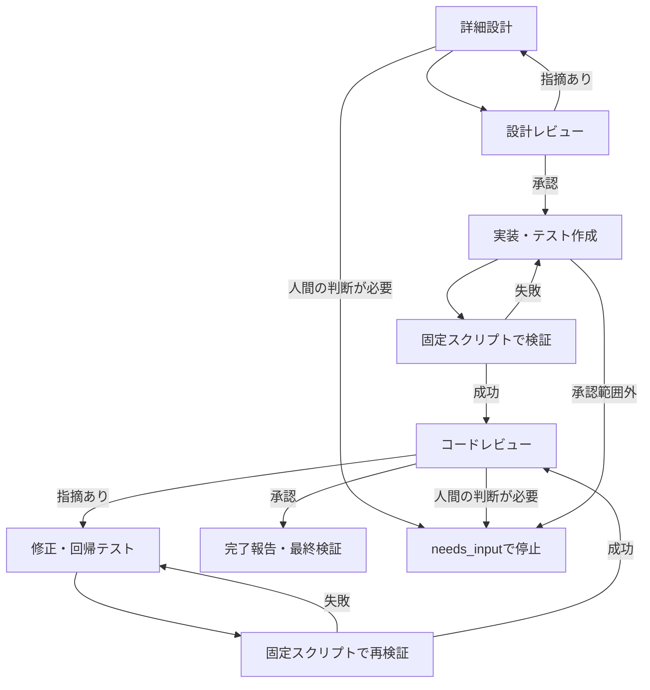

# TAKTでConstructionを進める

> 履歴: 以下はCG単体への委譲に方針を絞る前の検討・実験です。現在の設計は[CGの動作](code-generation.md)、設定は[導入手順](getting-started.md)を参照してください。旧Inception委譲は`handoffStage: "inception-legacy"`の明示が必要です。

## 設計・レビュー・実装・検証を一つのWorkflowにした

[aidlc-construction.yaml](../takt/aidlc-construction.yaml)は、承認済みのInception文書から詳細設計を作り、設計レビュー、実装、テスト、コードレビュー、修正、完了報告まで進める。AI-DLC本体はparkのまま保持する。



設計者、設計レビュアー、実装者、コードレビュアーは別のセッションを使う。実装と修正は同じ実装担当セッションで進める。ここでのレビュー承認はAIによる技術的な判定であり、人間の設計承認を意味しない。要件・契約の変更など新しい判断が必要なら質問を残して止まる。

TAKT 0.65.0の`output_contracts`、`session_key`、コマンド形式の`quality_gates`を使用している。コマンド検証が失敗すると、TAKTが同じ実装工程へ差し戻す。[TAKTのWorkflow仕様](https://github.com/nrslib/takt/blob/v0.65.0/docs/workflows.ja.md)

## 有効にする

最終承認の前に、対象プロジェクトの`aidlc/takt-handoff/`へWorkflowをコピーし、既存の設定に次を追加する。

```json
{
  "workflow": "aidlc/takt-handoff/workflow.yaml",
  "construction": true,
  "disableBedrock": true,
  "timeoutMs": 600000
}
```

これは設定の差分であり、単独では使えない。既存の`enabled`、`artifacts`、`sources`、`verifyScript`、`provider`も必要である。[設定全体の説明](handoff-poc.md)を参照。

ビルド後の配布物にも`takt/aidlc-construction.yaml`を含めている。`construction: true`の場合、連携CLIが品質ゲート用の同梱ツールを実行用ディレクトリへ配置し、TAKTのコマンドゲートを有効にする。WorkflowだけをTAKTへ直接渡すと、ゲート用ツールが存在しないため動かない。

このリポジトリの実験用設定では、最終承認前に次を実行できる。

```sh
bun experiments/native-session/configure.ts <native-run-dir> --tests --construction
```

承認済みの実行設定や入力を途中で差し替えてはいけない。以前の実行を残したまま、新しい依頼の入力として確定する。

## AI-DLCのConstructionとの対応

| 内容 | このWorkflowの担当 |
|---|---|
| 機能設計、非機能要件・設計、インフラの要否 | 詳細設計レポートの各項目 |
| 設計とInceptionの整合性 | 設計レビュー |
| 実装、テスト作成、レビュー指摘の解消 | 実装・修正工程 |
| ビルド・テスト | プロジェクトが指定した固定の検証スクリプト |
| CI設定 | 承認済み要件で必要な場合のみ実装対象に含める |
| Operation、マージ、デプロイ | このWorkflowの対象外 |

複数Unitは設計レポートで依存順に並べ、実装担当がその順に作業する。依存先の未定義、循環、順序の逆転は品質ゲートが拒否する。ただし、現状は一つの作業領域を使う直列実行であり、Unitごとに独立した作業領域や並列スケジューラを作る機能はない。

## 成功を判定する条件

品質ゲートはモデルの応答とは別プロセスで実行する。判定記録は作業領域の外側の`control/`に、モデルが参照するテスト結果のコピーは作業領域内の`construction/verification.json`に保存する。

- 設計・設計レビュー中にソースが変わっていないこと。
- 必須の設計項目があり、未回答の質問を抱えたまま実装へ進んでいないこと。
- レビュー済みの設計と、現在の設計のハッシュが一致すること。
- 固定した検証スクリプトが終了コード0で完了すること。
- テスト後のコードと、コードレビュー対象のコードが一致すること。
- 未解決指摘がないこと。指摘を残したまま`approved`としてもゲートが拒否する。
- レビュー後にコードやレビュー記録が変わっていないこと。
- 完了報告があり、連携CLIが最後にもう一度独立検証を通すこと。

コード識別では`.git`、`.claude`、`.takt`、`construction`、`coverage`、`.handoff-coverage-*`を除く。それ以外の新規ファイルも対象にする。検証スクリプトが別の場所へ実行ごとに変わる出力を作ると、コードの変更として検出されるため、プロジェクトに合わせて出力先を整理する必要がある。

これらは誤操作や古い検証結果の流用を検出する仕組みであり、同じOSユーザーで動く任意のプログラムを隔離するセキュリティ境界ではない。

## 停止と結果

| 状態 | 意味 | 次の操作 |
|---|---|---|
| `verified` | 設計・レビュー・検証・完了報告が揃った | 差分と報告を確認して取り込む |
| `needs_input` | 要件や契約など、人間の判断が必要 | 質問に回答し、必要ならInception側を見直して新しい依頼を作る |
| `failed` | 時間・工程数の上限、検証失敗、実行エラー | ログを確認し、同じ条件で再実行できる場合は`retry`を使う |

`needs_input`を通常の`retry`で押し通すことはできない。設計・レビューではJSONレポートの`questions`、実装・修正では`construction/questions.json`に質問を残し、状態確認コマンドにも表示する。

既定は最大18工程、実験の時間上限は10分。Constructionを有効にした場合、時間上限は設定で最大1時間まで指定できる。上限で止まった場合は、途中に成功したテストがあっても全体を成功扱いしない。テスト条件の十分性とレビューの実質的な質は、プロジェクト側の要件・検証スクリプト・モデルの判断に依存する。

## 再現する

```sh
bun run test
bun run typecheck
bun run experiment:construction -- --repairs
bun run experiment:construction -- --live
```

`--repairs`は決定的なmock応答を使い、設計差し戻し・テスト失敗・コード指摘を意図的に起こす。TAKTの実行エンジンと検証コマンドは実物である。`--live`はClaudeの実モデルを呼び出す。

試験入力には以前の実AI-DLCセッションで承認された文書のコピーを使い、引き継ぎ境界の状態・承認イベントは合成データとして明示する。新しいWorkflowを評価する試験であり、通常のInceptionを再び最初から実行する試験ではない。
