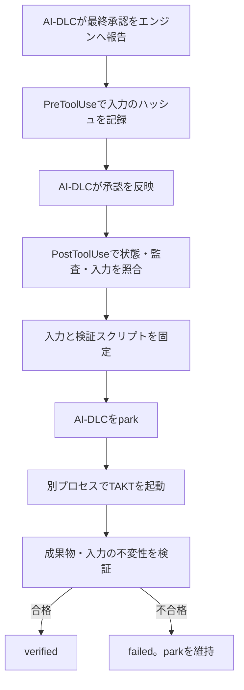

# Inception承認後の自動引き継ぎPoC

> Claude Codeプラグインとしてパッケージ化した。[プラグインの利用手順](claude-plugin.md)を参照。プラグインを使う場合、この文書の手動フック登録は不要である。

## フックからpark・TAKT起動・受入検証まで動いた

2026年9月15日、承認後を表す合成イベントを入力し、実際のフック処理、AI-DLCのpark、TAKTからClaude Codeの呼び出し、成果物の検証まで実行した。結果は **VERIFIED**。出力側の`answer`は41から42に変わり、元のソースと要求文書は変わらなかった。

これは最初のPoCの記録である。その後、通常のAI-DLCセッションでの最終承認から手動復旧なしに引き継げることも確認した。[実セッションの記録](../experiments/native-session/STATUS.md)を参照。[保存した実測結果](../experiments/automatic-handoff/results/2026-09-15.json)

## 承認前の入力記録と承認後の確認を組み合わせる



接続するのはDelivery Planningに対する`report --result approved`である。引き継ぎ処理は次を確認する。

- 承認コマンドに対応するPreToolUseの入力記録が存在する。
- コマンドが正常な`kind: done`などを返し、`kind: error`ではない。
- Inceptionの各工程が完了またはスキップされ、Delivery Planningが完了している。
- 現在の監査記録にDelivery Planningの承認と完了があり、後から差し戻されていない。
- AI-DLCがConstruction開始前の状態にあり、自律Constructionに入っていない。
- 承認処理の前後で、指定した成果物・ソース・Workflow・検証スクリプト・連携設定が変化していない。

本体は承認記録を生成しない。テストだけが、実際の人の承認と区別した合成記録を用意する。

## 入力を固定し、出力と検証の場所を分ける

実セッションでは、Gitで無視した`.takt-aidlc/`や`.claude/`内の追加ファイルもAI-DLCのソース識別に影響した。管理情報は、ソース識別から除外される`aidlc/takt-handoff/`へ分離する。AI-DLCが管理する`aidlc/spaces/`内の要件・状態・承認記録を書き換えるものではない。旧PoCの`.takt-aidlc/`も読めるが、両方に設定がある場合は拒否する。

引き継ぎIDはIntentの記録先と承認イベントから決まる。同じ承認に対する通知を再送しても、同じIDになる。変更された入力で同じ承認を再利用すると拒否する。

```text
<AI-DLCプロジェクト>/aidlc/takt-handoff/
  config.json
  pending/                  承認コマンド実行前の記録
  runs/<id>/
    manifest.json           固定した入力・設定と承認の対応
    snapshot/               原本のコピー。読取専用
    status.json             引き継ぎの状態
    park.json               parkの実行結果
    worker.log
    attempts/1/
      work/                 TAKTが変更する独立したGit作業領域
        input/              Inception成果物と入力一覧
        src/                アプリケーションのソース
      takt.json
      verification.json
```

`work`には指定したソースだけをコピーする。元のAI-DLCの状態や制御設定はコピーしない。Claude Codeを使う場合は、作業領域側の設定を読み、Read・Write・Editで実装する。通常のプロジェクトに必要な規約やファイルは、利用者が明示的に入力へ含める必要がある。

検証スクリプトはTAKTの作業領域の外に固定し、作業領域をカレントディレクトリとしてBunで実行する。TAKTの終了コードが0でも、検証が通らなければ`failed`になる。検証後にも入力コピー、元のファイル、固定したスクリプトのハッシュを確認する。

これは誤更新の検出と工程分離のための仕組みで、任意の悪意あるプロセスを完全に隔離するサンドボックスではない。

## 再現方法

リポジトリのルートで開発用依存を入れる。

```sh
bun install --frozen-lockfile
```

初回は、インストール済みのaidlc 2.8.2からテスト用のClaude Codeランタイムを用意する。

```sh
bun run prepare:test-runtime
```

型検査とテストを実行する。テストは実際のTAKT CLIのmockプロバイダーを使い、モデルを呼ばない。

```sh
bun run typecheck
bun run test
```

フック処理とバックグラウンド起動を含むデモを実行する。

```sh
bun experiments/automatic-handoff/run.ts
```

実モデルでも試す場合は、認証済みClaude Codeを用意して次を実行する。モデル利用量が発生する。

```sh
bun experiments/automatic-handoff/run.ts --live
```

各実行は新しい架空プロジェクトを作る。デモは同じ承認後通知を2回送り、実行回数が1回であることも確認する。実行結果と生ログは`.experiments/automatic/`に残る。

## 通常のAI-DLCセッションへ接続する設定

対象は`aidlc` 2.8.2で設定したClaude Code環境に限定する。工程操作には`aidlc`コマンドを使い、連携処理自体はBunで動く。TAKT 0.65.0とClaude Code 2.1.270で接続後の実行を確認した。

対象プロジェクトに`aidlc/takt-handoff/config.json`を作る。以下は例であり、Intentのパスと各ファイルは実在するものに置き換える。

```json
{
  "enabled": true,
  "artifacts": [
    "aidlc/spaces/default/intents/<intent>/inception/requirements-analysis/requirements.md",
    "aidlc/spaces/default/intents/<intent>/inception/delivery-planning/bolt-plan.md"
  ],
  "sources": ["src/value.ts"],
  "workflow": "aidlc/takt-handoff/construction.yaml",
  "verifyScript": "aidlc/takt-handoff/verify.ts",
  "provider": "claude",
  "disableBedrock": true,
  "timeoutMs": 90000
}
```

入力は通常ファイルを列挙する。ディレクトリ指定やシンボリックリンクは未対応。実際の開発では、Unit分割・依存関係・共有契約・必要な設計・規約も漏れなく指定する。

次のコマンドは、そのプロジェクト用のフック設定をJSONで表示する。表示されたPreToolUseとPostToolUseの項目を、既存の`.claude/settings.json`の対応する配列へ追加する。既存のAI-DLCフックは残す。

```sh
bun src/handoff/cli.ts hooks <対象プロジェクトの絶対パス>
```

処理対象は、`aidlc engine orchestrate report`、またはプロジェクト内の`aidlc.ts`／`aidlc-orchestrate.ts`をBunで呼ぶ単一コマンド。`--stage delivery-planning --result approved`を認識し、引数の順序変更と`--user-input`も扱う。シェル展開、コマンド連結、`--single`、その他の呼び出し方には対応しない。

`enabled: true`でこのフックを登録すると、Inceptionの承認後に指定したTAKT Workflowが自動実行される。利用時は、この引き継ぎ方針を最終承認の内容に含める。

## 状態確認と再試行

```sh
bun src/handoff/cli.ts status <対象プロジェクト> <id>
bun src/handoff/cli.ts retry <対象プロジェクト> <id>
```

通常の起動失敗や検証失敗は`failed`に記録する。再試行は固定した入力と現在の原本が一致する場合だけ認め、別の作業領域を作る。前の試行は比較用に残す。入力や計画を変える場合は、AI-DLC側で見直して再承認する。

並行workerは排他ロックで二重実行を防ぐ。workerが強制終了した場合のロック回収と、状態保存の途中でプロセスが落ちた場合の自動復旧は未実装。ロックが残ったときは自動で再実行せず、プロセスと成果物を確認する必要がある。

## 検証結果と残る範囲

初期PoCでは11件のテストが通った。承認記録の欠落、入力変更、偽のコマンド表現、エンジンのエラー応答、二重通知、並行実行、検証失敗、再試行、自律Constructionや差し戻しを扱っている。型検査も通った。

実モデルのデモでは、合成した承認後イベントから実際のフック処理がTAKTを起動し、1回の実行で編集と検証に成功した。元の要求とソースは不変、AI-DLCはpark中のままである。

現在は通常の最終承認からの自動引き継ぎと、[Construction専用Workflow](construction-workflow.md)も実装・検証済みである。Constructionを有効にする場合は`construction: true`を指定し、専用Workflowと入力を最終承認前に設定する。確認待ちは`needs_input`として保存し、通常の`retry`では再開しない。

複数監査シャード、Codexをホストにしたプラグイン、Unit単位の並列作業領域、AI-DLCのOperationへの復帰は未対応である。最新の実行範囲は[Constructionの結果](../experiments/construction/RESULTS.md)を参照。
