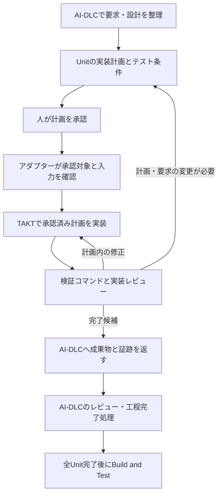

# AI-DLC v2とTAKTは、承認済みUnitの実装で接続する

調査日: 2026年9月15日。品質改善を主目的とした統合案の比較。

> 会話後の方針: Inception完了後にAI-DLCが自動でparkし、TAKTへConstruction全体を引き渡す案を第一候補として具体化した。[自動引き継ぎ案](automatic-handoff.md)を参照。本稿のUnit単位の委譲は、当初の比較・推奨案として残す。

## 1. 推奨は、AI-DLCに工程管理を残す段階的な統合

**AI-DLCを工程全体の管理役にし、承認済みの1 Unitの実装・検証・修正をTAKTへ委譲する構成を推奨する。** Unitは、AI-DLCが定める実装対象のまとまりを指す。

当初案の「ConstructionだけTAKTで実行する」は方向としてよい。ただしConstructionには詳細設計も含まれるため、最初はCode Generationの実装部分まで境界を狭めたい。要求、設計、実装計画、計画承認、工程の完了判定はAI-DLCに残す。

品質が上がるかは未検証。AI-DLC v2にも独立レビュー、修正ループ、テストによる完了確認がある。TAKT追加の価値は、同じ確認を増やす量では測れない。まず追加レビューで有効な欠陥を発見できるか確かめ、その結果を踏まえて実装の委譲へ進む。

tmuxは対話セッションの起動・接続に使えるが、それ自体に品質改善の仕組みはない。統合では「誰が次の工程を決めるか」と「どう実行プロセスにつなぐか」を別々に選ぶ。

## 2. AI-DLC v2にも工程を制御するエンジンがある

### 調査対象はv2.8.2とTAKT v0.65.0

両リポジトリを一時ディレクトリに取得し、ドキュメント、工程定義、MCPサーバー、実行処理を照合した。AI-DLCの最新安定リリースは調査時点でv2.8.2。TAKTはv0.65.0タグを確認した。さらに次のmainのコミットとの差分を調べた。

| 対象 | タグのコミット | 調査したmain |
|---|---|---|
| AI-DLC | `355903d6` | `a8c477c2` |
| TAKT | `b2a1a185` | `88dcf8f4` |

AI-DLCのmainには2.9.0向けの変更がある。本提案の中心となる計画承認、実装委譲、MCP、tmuxの説明はタグ側でも確認し、mainだけにある待機コマンドなどは前提にしていない。[AI-DLC v2.8.2](https://github.com/awslabs/aidlc-workflows/releases/tag/v2.8.2)、[TAKT v0.65.0](https://github.com/nrslib/takt/tree/v0.65.0)

### 重複する機能が多く、役割分担が必要

| 項目 | AI-DLC v2 | TAKT | 統合への意味 |
|---|---|---|---|
| 工程制御 | エンジンが次の処理をJSONで指示 | WorkflowのStepと遷移規則 | 工程全体の決定権を一方に置く |
| レビュー | 工程・スコープに応じた独立レビュー | 複数観点のレビュー、指摘の判定、修正ループ | 確認する観点と完了条件を分ける |
| 並列実行 | Unitの依存関係とSwarm | 並列Stepとタスク実行 | 同じUnitを両方で並列化しない |
| 作業領域 | Unit用worktreeと統合処理 | タスク用worktree | 作成・統合の担当を決める |
| 状態・証跡 | Intent単位の状態と監査記録 | Task/Run、ログ、レポート | 状態を複製せず識別子で関連付ける |

AI-DLCではエンジンが工程間の遷移を担当し、ハーネス上のconductorが対話や工程内の作業を担当する。`next`の指示を受け、作業結果を`report`へ返す構造である。TAKTにもWorkflowによる明示的な制御があるため、両方を全工程の管理役にすると重複が生じる。[AI-DLCのエンジン設計](https://github.com/awslabs/aidlc-workflows/blob/v2.8.2/docs/reference/17-skill-system.md)、[TAKTのWorkflow定義](https://github.com/nrslib/takt/blob/v0.65.0/docs/workflows.md)

また、AI-DLCのSwarmは独立worktree、プロジェクトの検証コマンド、保護対象テストの改変検査を備える。「並列化とレビューを追加すれば品質が上がる」という説明だけでは、TAKTを導入する理由として足りない。[ConstructionとSwarm](https://github.com/awslabs/aidlc-workflows/blob/v2.8.2/docs/harness-engineering/08-construction-and-swarm.md)

## 3. 統合範囲は4案、接続方法は別軸で選ぶ

以下の評価は、上記の実装を根拠にした設計上の判断であり、性能や品質の実測結果ではない。

| 案 | 管理の境界 | 期待できる価値 | 主な負担 | 判断 |
|---|---|---|---|---|
| A. Unitの実装を委譲 | AI-DLCが工程を管理し、TAKTが工程内を実行 | 要求との対応を保ち、実装ループを調整できる | 承認・成果物を結ぶアダプター | 推奨 |
| B. Construction全体を移す | Inception完了でTAKTへ管理を引き継ぐ | TAKT中心の開発に寄せやすい | 詳細設計、状態、Operationへの復帰の再設計 | 移行を目的にする場合 |
| C. ネイティブAI-DLCセッションを外から操作 | 内側のAI-DLCが工程を管理 | 起動・監視・対話窓口の統一 | 入力待ち、終了判定、承認の受け渡し | 操作の統一が目的なら候補 |
| D. TAKTをAI-DLCの新ハーネスとして実装 | AI-DLCエンジンの指示をTAKTが実行 | 全工程を共通の窓口で扱える | 指示、フック、対話、再開の互換実装 | 長期案 |

BでAI-DLCの設計文書を読ませるだけなら試しやすい。ただし、AI-DLC v2の工程・承認・監査まで継続するには、TAKTの完了結果をAI-DLCへ戻す処理が必要になる。

Cも、起動と監視だけを担当するなら責任の衝突は少ない。外側にも「次は設計、次は実装」という遷移を置くと、内側のAI-DLCとの整合を取り続ける必要が出る。

### 接続はCLIを先に、MCPは利用形態に応じて採用

TAKTはClaude CodeのCLIやSDK、Codex SDKなどをプロバイダーとして呼び出せる。さらに`claude-terminal`という実験的なプロバイダーがあり、tmuxでClaude Codeを起動し、トランスクリプトから応答を読む。調査範囲では、同等のCodex用terminalプロバイダーは確認していない。[プロバイダー設定](https://github.com/nrslib/takt/blob/v0.65.0/docs/configuration.md)、[terminal実装](https://github.com/nrslib/takt/blob/v0.65.0/src/infra/claude-terminal/client.ts)

TAKTのMCPサーバーは`takt_enqueue_task`、`takt_list_tasks`、`takt_get_run`、`takt_tell_run`の4ツールを公開する。登録後の実行には`takt run`または`takt watch`を別プロセスで動かす必要がある。MCPには、この4ツールと対になる汎用のキャンセル操作は公開されていない。[MCPサーバー実装](https://github.com/nrslib/takt/blob/v0.65.0/src/features/mcp/server.ts)

初期PoCは、AI-DLCが用意した作業領域内でTAKTを直接起動する方が、キューやworktreeの管理を増やさずに済む。既存CLIには`--pipeline --skip-git`があり、TAKTによるブランチ作成・コミット・pushを省略できる。ただし独自Workflow内のGit操作までは禁止しないので、専用Workflow側にも境界を定義する。[CLIの実行オプション](https://github.com/nrslib/takt/blob/v0.65.0/docs/cli-reference.md#pipeline-mode)

## 4. Code Generationの計画承認後に受け渡す

AI-DLCのConstructionは、機能設計、非機能要件、非機能設計、インフラ設計、コード生成、Build and Test、CI Pipelineで構成される。各工程の実行要否はスコープに依存する。Build and TestはUnitごとではなく、各Unitの作業が終わった後に一度実行する。[Constructionの工程一覧](https://github.com/awslabs/aidlc-workflows/blob/v2.8.2/docs/reference/04-stages/construction.md)

推奨構成は、次のようになる。

Code Generationには計画作成と人によるPlan Approvalがあり、その後にdeveloperへ実装を委譲する。この箇所を接続点の候補とする。TAKTに既定の`default` Workflowをそのまま実行させると、計画を作り直す工程まで重なるため、承認済み計画から始める専用Workflowが必要になる。[AI-DLCのCode Generation](https://github.com/awslabs/aidlc-workflows/blob/v2.8.2/core/aidlc-common/stages/construction/code-generation.md)、[TAKTの既定Workflow](https://github.com/nrslib/takt/blob/v0.65.0/builtins/en/workflows/default.yaml)

TAKTの検証には実際のコマンド実行を組み込む。`quality_gates`の文字列はAIへの指示であり、機械的に実行するには`type: command`を使い、`workflow_command_gates.custom_scripts`を有効にする必要がある。[検証ゲートの仕様](https://github.com/nrslib/takt/blob/v0.65.0/docs/workflows.md)

### 渡すのはUnitの依頼一式、返すのは検証可能な成果物

| 境界 | 必要な内容 |
|---|---|
| 対象 | Intent、Unit、Stage、試行番号、作業ディレクトリ |
| 承認された内容 | 実装計画、Testing Contract、Unit用テスト手順、承認の参照 |
| 要求との対応 | 受入条件のID、非機能要件、共有API・データ契約、必要な上流文書 |
| 実行条件 | 基準コミットと未コミット差分の識別、変更可能な範囲、検証コマンド、時間・反復上限 |
| 返却するもの | 変更内容、コード概要、要求と実装の対応、テスト結果、レビュー結果、未解決事項、TAKTのRun識別子 |

これは提案する連携契約であり、既存の共通APIではない。AI-DLCの実装委譲用briefを使い、承認された計画とテスト条件をそのまま渡す。TAKT内の各担当には必要な情報を配るが、承認対象の計画を要約だけで置き換えない。

成果物にはAI-DLCが要求する`source-manifest.json`と`traceability.json`も必要になる。前者は生成・変更・削除したソースの範囲、後者は要求IDと実装・テストの対応を示す。ファイルがあるだけで受け入れず、内容と実際の変更を照合する。承認と成果物の仕様は[Code Generation定義](https://github.com/awslabs/aidlc-workflows/blob/v2.8.2/core/aidlc-common/stages/construction/code-generation.md)を正とする。

### 状態、承認、作業領域の担当を固定する

AI-DLCが工程の状態を更新し、TAKTは自分のRunの状態を更新する。アダプターは両者の識別子、入力の版、受け渡し状況だけを記録する。たとえばTAKTが`COMPLETE`を返しても、AI-DLCのレビューが未完了ならCode Generationを完了扱いにしない。

人の承認は元のAI-DLCセッションで受け付ける。v2.8.2のPlan Approvalは、計画・テスト条件・試行に結び付いた記録を要求する。アダプターが承認済みの文字列を作ったり、状態Markdownへチェックを書いたりして進める方式は採らない。[計画承認ガード](https://github.com/awslabs/aidlc-workflows/blob/v2.8.2/core/hooks/aidlc-plan-approval-guard.ts)

初期PoCは1 Unit・1作業領域・逐次実行とする。worktreeを利用する場合はAI-DLC側が所有し、TAKTはその中で実行する。並列化を加える際も、AI-DLCがUnit間の依存関係と統合順序を管理する。TAKT側でUnit用worktreeをさらに作る二重管理は避ける。

AI-DLCの既定レビューも最初は維持する。TAKTは実装上の欠陥や検証失敗の修正を担当し、AI-DLCには要求・契約との整合を含む最終レビューを返す。レビュー記録はソースの内容にも結び付くため、TAKTのレポートをAI-DLCのレビュー済み記録として転記してはならない。[AI-DLCのレビュー手順](https://github.com/awslabs/aidlc-workflows/blob/v2.8.2/core/aidlc-common/protocols/stage-protocol-reviewer.md)

## 5. 設定だけで差し替えられる状態にはない

### 必要なのは、外部実行を受け入れる明示的な接続点

AI-DLCプラグインには、新しいStageを加えたり、既存Stageに成果物・センサー・説明文を追加したりする仕組みがある。ただし既存Stageへのcontributionは追加方式で、上書き・削除は対象外。`code-generation`の担当をTAKTへ切り替える設定は、今回調べた拡張仕様では確認できなかった。[プラグインの拡張範囲](https://github.com/awslabs/aidlc-workflows/blob/v2.8.2/docs/harness-engineering/10-authoring-a-plugin.md#3-modify-an-existing-core-stage-a-contribution)

したがって、実装委譲にはconductorの実装委譲部分に限定した拡張が必要になる。試作時は変更箇所を管理した専用conductor、継続利用時は上流へ外部executorの接続点を提案する進め方が妥当だと考える。プラグインの説明文でTAKTを追加実行するだけでは、元のdeveloper実行も残ってしまう。

全工程を統合するD案なら、AI-DLCの新ハーネスとして対応する公式の移植手順がある。ただしTAKTのWorkflowを置くだけでは済まず、engineの指示、対話、フック、セッションの意味をTAKT側の実行と結ぶ必要がある。なお型定義にある`dispatch-subagent`はv2.8.2では将来用で、現在発行される指示として使えない。[新ハーネスへの移植](https://github.com/awslabs/aidlc-workflows/blob/v2.8.2/docs/harness-engineering/09-porting-to-a-new-harness.md)、[実際に発行される指示](https://github.com/awslabs/aidlc-workflows/blob/v2.8.2/docs/reference/17-skill-system.md#2-the-typed-directive-contract)

### このリポジトリではWorkflowとアダプターを分けて作る

`takt-aidlc`に持たせる機能は、次の3つを候補とする。いずれも未実装である。

1. **専用Workflow**: 承認済みUnitから開始し、実装・検証・レビュー・修正を実行する。
2. **受け渡しアダプター**: 入力確認、実行、結果検証、再開時の照合を担当する。
3. **AI-DLC側の接続処理**: 外部実行の結果を通常のレビューと工程完了処理へ戻す。

TAKTのWorkflowやfacetはRepertoireで配布できる。ただし取り込まれるディレクトリは限定され、任意のアダプター実行コードまで配布されるわけではない。アダプターのインストール方法は別途用意する。[Repertoireの配布対象](https://github.com/nrslib/takt/blob/v0.65.0/docs/repertoire.md#package-structure)

### 最初に検証するのは正常系と中断後の整合

| 条件 | 期待する挙動 |
|---|---|
| 承認済み計画と現在の入力が一致 | 対象Unitの実装を開始できる |
| 計画・テスト条件が実行中に変化 | 旧計画の成果物を完了として取り込まず、AI-DLCへ戻す |
| 検証コマンドが失敗 | 上限内で修正し、解消しなければ理由付きで停止 |
| TAKT終了直後にアダプターが中断 | 既存Runと成果物を照合し、二重実行・二重反映を防ぐ |
| 同一Unitへの依頼を再送 | 同じ依頼を識別し、重複起動を防ぐ |
| レビュー後にコードが変化 | 古いレビューを流用せず再確認する |
| 人の判断が必要 | 元のAI-DLCセッションへ返し、時間経過を承認扱いしない |

特に、外部プロセスの書き込みとAI-DLCの承認ガード・レビュー用フックの整合は、実機検証が必要である。TAKTがハーネスを起動できることだけでは、AI-DLCの承認や監査が正しく動く根拠にはならない。

tmux案を試す場合にも同じ問題がある。加えてTAKTはClaude系のSkill探索を既定で無効にするため、ネイティブAI-DLCを呼ぶには明示的な有効化が必要になる。Skillを有効化してもフック互換まで保証されない。[Skill継承の設定](https://github.com/nrslib/takt/blob/v0.65.0/docs/configuration.md#claude-skill-inheritance-skills)

## 6. 品質改善を確かめてから実装の委譲へ進む

### 第1段階: AI-DLC単体とTAKT追加レビューを比較

AI-DLCを通常どおり実行し、確定した同じコード・要求・設計をTAKTの読取専用レビューへ渡す。TAKTの出力は追加の指摘として扱い、AI-DLCの公式レビュー記録を置き換えない。この段階なら、実装担当を差し替える前にTAKTの追加価値を測れる。

評価対象は6〜10件程度を目安とし、単純な修正、境界条件を持つ機能、Unit間契約に触れる機能を含める。これは試行規模の提案であり、統計的な効果を保証する件数ではない。モデル、推論設定、基準コード、受入条件を記録し、可能な範囲で条件をそろえる。

| 評価指標 | 確認する内容 |
|---|---|
| 有効な追加指摘 | AI-DLC側で残った再現可能な欠陥を見つけたか |
| 誤指摘・重複 | 不要な修正や同じ議論を増やしていないか |
| 要求充足 | 事前に固定した受入テストと非機能条件を満たすか |
| 人の負担 | 指摘の判定、追加説明、修正判断にかかる時間 |
| 実行負担 | 経過時間、呼び出し数、取得できる利用量・費用 |

指摘件数だけで判断しない。期待する効果は「重要な見逃しを減らせる」「人が修正を指示する回数を減らせる」のどちらかである。効果が小さければ、AI-DLC単体のテスト条件やレビュー観点を改善する選択も合理的だ。

### 第2段階: 承認済み1 Unitの実装をTAKTへ委譲

第1段階で価値が認められたら、外部実行の接続点と専用Workflowを試作する。正常終了だけでなく、承認の失効、テスト失敗、プロセス中断、重複依頼を検証する。

AI-DLC単体と比べる際は、TAKTに与えた計算量や追加レビュー回数も記録する。費用を増やした分の効果なのか、役割分担による改善なのかを区別するためである。判定には、実装担当から独立した受入テストと人の確認を使う。

### 第3段階: 必要になった機能だけ拡張

Unit単位で安定してから、MCPによる依頼登録、再開操作、並列Unitの実行を加える。操作窓口を統一したい場合は、その時点でtmux方式とAI-DLC新ハーネス方式を比較する。

## 7. 次に選ぶ行動

1. **推奨: 追加レビューの評価を設計する。** 比較対象と受入条件を決め、TAKTで増える価値を先に確かめる。
2. **実装に進む: 1 Unitの連携PoCを作る。** 品質効果の検証と並行して、承認・成果物・再開の互換性を確かめる。
3. **全体制御を優先する: 操作統一の要件を定める。** 対象ハーネス、対話の継続、必要な監視・再開操作からC案とD案を絞る。

本調査で実施したのはソースと仕様の静的確認までで、両製品を接続した実行、品質比較、ハーネス間の承認互換テストは行っていない。最初の判断は、TAKTを追加することで何が改善したかを測れる、小さな比較実験から始めるのがよい。
